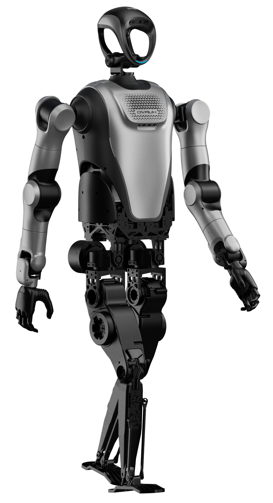

# 乐一通(LeT): 一种用于机器人学习的多任务人形机器人真机数据集

---

<div align="center">

**中文** | [English](README_EN.md)

</div>

---

## 📋 目录
- [🌟 概述](#概述)
- [✨ 核心特性](#核心特性)
- [🤖 硬件平台](#硬件平台)
- [🎬 任务](#任务)
- [📦 数据集](#数据集)
- [🚀 使用指南](#使用指南)
- [📊 统计数据](#统计数据)
- [📝 引用](#引用)
- [📄 许可](#许可证)
- [🙏 致谢](#致谢)

---

## 🌟 概述
我们推出 <strong>乐一通，Le-Tong(LeT)</strong>，一个在<strong>全尺寸人形机器人Kuavo 4 pro</strong>上采集的<strong>真实世界数据集</strong>，包含<strong>多任务、多场景</strong>演示。该数据集旨在为<strong>操作、移动和交互任务</strong>提供训练数据，支持真实环境中的可扩展机器人学习。

***(images@品宣)***

---

## ✨ 核心特性
- 🕐 海量的真实世界、全尺寸人形机器人数据集(持续更新中)

- 🌍 包括<strong>工业、家庭、医疗、服务等</strong>多个领域

- 🎯 覆盖<strong>抓取、双手操作、工具使用、移动、导航、交接、精细操作</strong>等任务

- ✅ <strong>经过专家标注和人工验证</strong>

- 🔧 从<strong>数据转换，模型训练到推理验证全流程</strong>的完整工具链

---

## 🤖 硬件平台
<div style="display: flex; justify-content: space-between; align-items: center;">
  
  
</div>

以上是我们数据集中使用的主要硬件平台，<strong>Kuavo 4 pro</strong> 和 <strong>Kuavo 4 pro 轮式版本</strong>。

- 📏 <strong>机器人参数</strong>：高度 1.66 米，重量 55 公斤，支持不停机电池更换
- 🎮 <strong>灵活运动控制</strong>：40 自由度，最大行走速度 7km/h，双足自主 SLAM
- 🧠 <strong>高泛化能力</strong>：支持接入盘古、DeepSeek、ChatGPT 等多模态大模型，总计 20+ 原子技能

---

## 🎬 任务
***(TBD)(GIF)@训练场***

---

## 📦 数据集

### 📁 数据集目录结构
***(a tree here@行帅)***

### 📄 数据格式

所有数据均为原始 **rosbag** 格式，详细信息如下：

> 📌 **注意**：点击下方每个主题以展开并查看详细。

<details open>
<summary><strong>Rosbag 主题演示</strong></summary>

<details>
<summary>相机 RGB 图像数据</summary>

- <strong>/cam_x/color/image_raw/compressed</strong>
    1. 描述

        此ROS Topic用于提供来自相机传感器的压缩后原始 RGB 成像数据。x 可以是 h、l 或 r，分别表示头部、左手腕和右手腕相机

    2. 消息类型

        类型：sensor_msgs/CompressedImage

    3. 消息本体
        - header (std_msgs/Header)：消息头；包括时间戳、序列号、坐标系标识等
        - format (string)：图像编码格式
        - data (uint8[])：图像数据

</details>

<details>
<summary>相机深度图像数据</summary>

- <strong>/cam_x/depth/image_rect_raw/compressed</strong>
    1. 描述

        此ROS Topic用于提供来自相机传感器的压缩后原始深度成像数据。x 可以是 h、l 或 r，分别表示头部、左手腕和右手腕相机

    2. 消息类型

        类型：sensor_msgs/CompressedImage

    3. 消息本体
        - header (std_msgs/Header)：消息头；包括时间戳、序列号、坐标系标识等
        - format (string)：图像编码格式
        - data (uint8[])：图像数据

</details>

<details>
<summary>手臂轨迹控制</summary>

- <strong>/kuavo_arm_traj</strong>
    1. 描述

        此ROS Topic用于控制机器人的手臂轨迹。它发布手臂目标关节位置，以高精度控制手臂。

    2. 消息类型

        类型：sensor_msgs/JointState

    3. 消息本体
        - header (std_msgs/Header)：消息头；包括时间戳、序列号、坐标系标识等

        - name (string列表)：手臂关节列表。当总共有 14 个关节时，名称将从 "arm_joint_1" 到 "arm_joint_14"

        - position (float列表)：当前手臂关节位置列表。数据结构类似于下面 sensor_data_raw 的第 12-25 项。

</details>

<details>
<summary>原始传感器数据</summary>

- <strong>/sensors_data_raw</strong>
    1. 描述

        用于发布所有真实机器人或模拟器原始传感器数据的主题，从关节数据到 IMU 数据再到末端执行器数据

    2. 消息类型
        
        类型：kuavo_msgs/sensorsData

    3. 消息本体
        
        - sensor_time (time)：时间戳

        - joint_data (kuavo_msgs/jointData)：关节数据：位置、速度、加速度、电流

        - imu_data (kuavo_msgs/imuData)：包括陀螺仪、加速度计、自由角速度、四元数

        - end_effector_data (kuavo_msgs/endEffectorData)：末端执行器数据，当前未使用。

    4. 关节数据描述
        - 数据顺序

            - 前 12 个元素是下半身电机数据：

                - 0~5 是左肢数据 (l_leg_roll, l_leg_yaw, l_leg_pitch, l_knee, l_foot_pitch, l_foot_roll)

                - 6~11 是右肢数据 (r_leg_roll, r_leg_yaw, r_leg_pitch, r_knee, r_foot_pitch, r_foot_roll)

            - 随后 14 个元素是手臂电机数据：

                - 12~18 是左臂电机数据 ("l_arm_pitch", "l_arm_roll", "l_arm_yaw", "l_forearm_pitch", "l_hand_yaw", "l_hand_pitch", "l_hand_roll")

                - 19~25 是右臂电机数据 ("r_arm_pitch", "r_arm_roll", "r_arm_yaw", "r_forearm_pitch", "r_hand_yaw", "r_hand_pitch", "r_hand_roll")

            - 最后 2 个元素是头部电机数据：head_yaw 和 head_pitch

        - 单位：

            - 位置：弧度

            - 速度：弧度每秒 (radian/s)

            - 加速度：弧度每平方秒 (radian/s²)

            - 电流：安培 (A)

    5. IMU 数据描述
        - gyro：陀螺仪角速度，单位为 rad/s

        - acc：加速度计加速度，单位为 m/s²

        - quat：IMU 方向

</details>

<details>
<summary>灵巧手位置（仅真实机器人数据集）</summary>

- <strong>/control_robot_hand_position</strong>
    1. 描述

        此ROS Topic用于控制双手的运动。它发布目标关节位置，以高精度控制双手。

    2. 消息类型
        
        类型：kuavo_msgs/robotHandPosition

    3. 消息本体
    
        - left_hand_position (float列表)：左手位置，大小为 6 的数组，每个元素在 [0, 100] 之间，其中 0 表示完全张开，100 表示完全闭合

        - right_hand_position (float列表)：右手位置，大小为 6 的数组，每个元素在 [0, 100] 之间，其中 0 表示完全张开，100 表示完全闭合

</details>

<details>
<summary>灵巧手状态（仅真实机器人数据集）</summary>

- <strong>/dexhand/state</strong>
    1. 描述

        此ROS Topic用于发布灵巧手的状态

    2. 消息类型

        类型：sensor_msgs/JointState

    3. 消息本体
        - name (string列表)：关节名称列表，总共 12 个关节：

        - position (float列表)：关节位置列表，总共 12 个，前 6 个为左关节位置，后 6 个为右关节位置

        - velocity (float列表)：关节速度列表，总共 12 个，前 6 个为左关节速度，后 6 个为右关节速度

        - effort (float列表)：关节（电机）电流列表，总共 12 个，前 6 个为左关节电流数据，后 6 个为右关节电流数据

</details>

<details>
<summary>夹爪控制数据（仅真实机器人数据集）</summary>

- <strong>/control_robot_leju_claw</strong>
    1. 描述

        此ROS Topic用于控制机器人手部（即二指爪）

    2. 消息类型
    
        类型：kuavo_msgs/controlLejuClaw

    3. 消息本体
        - name (string列表)：长度为 2 的列表，由 "left_claw"、"right_claw" 组成

        - position (float列表)：长度为 2 的列表，包含左右爪的目标位置，每个元素在 [0, 100] 之间，其中 0 表示完全张开，100 表示完全闭合

        - velocity (float列表)：长度为 2 的列表，爪的目标速度，同样在 [0, 100] 之间。默认为 50。

        - effort (float列表)：长度为 2 的列表，爪的目标电流，单位为安培。默认为 1 安培

</details>

<details>
<summary>夹爪状态（仅真实机器人数据集）</summary>

- <strong>/leju_claw_state</strong>
    1. 描述
        
        /leju_claw_state 主题用于发布每个夹爪的状态、位置、速度和电流。

    2. 类型
        
        kuavo_msgs/lejuClawState

    3. 消息本体
        - state：数据类型 int8[]；长度为 2 的列表，表示夹爪状态。第一个元素表示左爪，另一个表示右爪。

        - data：数据类型 kuavo_msgs/endEffectorData；夹爪位置、速度和电流

        - 状态值的含义：

            - -1：错误，表示执行错误

            - 0：未知，初始化时的默认状态

            - 1：移动中，表示夹爪正在运动

            - 2：到达，表示已成功到达目标位置

            - 3：抓取，表示成功抓取物品

            请参阅 /control_robot_leju_claw 中的描述，了解数据中所有 kuavo_msgs/endEffectorData 消息。

</details>


<details>
<summary>仿真夹爪控制（仅模拟器数据集）</summary>

- <strong>/gripper/command</strong>
    1. 描述

        此ROS Topic用于控制模拟器中夹爪的运动。

    2. 消息类型

        类型：sensor_msgs/JointState

    3. 消息本体
        - header (std_msgs/Header)：消息头；包括时间戳、序列号、坐标系标识等

        - position (float列表)：大小为 2 的数组，数据为左右夹爪的目标位置，每个元素在 [0, 255] 之间，其中 0 表示完全张开，255 表示完全关闭。

</details>

<details>
<summary>仿真夹爪状态（仅模拟器数据集）</summary>

- <strong>/gripper/state</strong>
    1. 描述
        
        此ROS Topic用于捕获模拟器中夹爪的当前运动。

    2. 消息类型
        
        类型：sensor_msgs/JointState

    3. 消息本体
        - header (std_msgs/Header)：消息头；包括时间戳、序列号、坐标系标识等

        - position (float列表)：大小为 2 的数组，数据为左右夹爪的当前位置，每个元素在 [0, 0.8] 之间，其中 0 表示完全张开，0.8 表示完全关闭

</details>

<details>
<summary>机器人位置命令（仅模拟任务 4）</summary>

- <strong>/cmd_pose_world</strong>
    1. 描述
        
        用于发布机器人位置命令的主题

    2. 消息类型
        
        类型：geometry_msgs/Twist

    3. 消息本体
        - linear.x (float)：世界坐标系中的 x 方向数据，单位为米

        - linear.y (float)：世界坐标系中的 y 方向数据，单位为米

        - linear.z (float)：世界坐标系中的 z 方向数据，单位为米

        - angular.x (float)：世界坐标系中的 x 方向旋转角度，单位为弧度

        - angular.y (float)：世界坐标系中的 y 方向旋转角度，单位为弧度

        - angular.z (float)：世界坐标系中的 z 方向旋转角度，单位为弧度

</details>

</details>

### 🏷️ 标注格式
标注信息存储在与 bag 文件同名的 JSON 文件中。 

示例：
```json
{
  "loaction": "长三角一体化示范区智能机器人训练中心", // 数据来源
  "primaryScene": "默认一级场景", // 一级场景名称
  "primarySceneCode": "default_level_one_scene", // 一级场景代码
  "secondaryScene": "3C工厂场景", // 二级场景名称
  "secondarySceneCode": "3C factory manufacturing", // 二级场景代码
  "tertiaryScene": "线圈分拣", // 三级场景名称
  "tertiarySceneCode": "Coil sorting", // 三级场景代码
  "initSceneText": "各种颜色的线圈放置在桌子中间，物料箱放置在桌子两边，机器人位于桌子后方", // 初始场景描述
  "englishInitSceneText": "Coils of various colors are placed in the middle of the table, material boxes are placed on both sides of the table, and the robot is located at the back of the table", // 初始场景描述（英文）
  "taskGroupName": "单个线圈分拣", // 任务组名称
  "taskGroupCode": "single_coil_sorting", // 任务组代码
  "taskName": "7-22-线圈分类", // 任务名称
  "taskCode": "XQFL_11", // 任务代码
  "deviceSn": "P4-209", // 设备序列号
  "taskPrompt": "", // 任务描述
  "marks": [ // 标注段落
    {
      "taskId": "1947326026455584768", // 任务 ID
      "markStart": "2025-07-22 9:18:39.640", // 标注开始时间戳
      "markEnd": "2025-07-22 9:18:39.814", // 标注结束时间戳
      "duration": 0.233, // 标注持续时间（秒）
      "startPosition": 0.7363737795977026, // 标注开始位置
      "endPosition": 0.769568869806783, // 标注结束位置
      "skillAtomic": "pick", // 原子技能
      "skillDetail": "从桌子上拿起线圈", // 技能详情
      "enSkillDetail": "pick coil from table", // 技能详情（英文）
      "markType": "step" // 标注类型
    },
    {
      "taskId": "1947326026455584768", // 任务 ID
      "markStart": "2025-07-22 9:18:40.950", // 标注开始时间戳
      "markEnd": "2025-07-22 9:18:41.180", // 标注结束时间戳
      "duration": 0.23, // 标注持续时间（秒）
      "startPosition": 0.9228460404165317, // 标注开始位置
      "endPosition": 0.9556361498412722, // 标注结束位置
      "skillAtomic": "place", // 原子技能
      "skillDetail": "将线圈放置到物料箱中", // 技能详情
      "enSkillDetail": "place coil in material box", // 技能详情（英文）
      "markType": "step" // 标注类型
    }
  ]
}
```

---

## 🚀 使用指南

我们提供了一个全面的示例仓库来演示如何使用我们的数据集，包括：

- 🔄 <strong>数据转换工具 (`rosbag2lerobot`)</strong> 将原始 rosbag 文件转换为适合模型训练的lerobot格式
- 🤖 <strong>两种模仿学习模型</strong>：Diffusion Policy 和 ACT
- 🎓 <strong>模型训练脚本</strong> 用于在我们的数据集上进行训练
- 🚁 完整的代码和<strong>部署</strong>说明，适用于真实世界机器人和模拟环境

请参考我们的开源仓库：<strong>[kuavo_data_challenge](https://github.com/LejuRobotics/kuavo_data_challenge)</strong>。

该仓库包含文档、设置说明和运行示例。

---

## 📊 统计数据
(TBD)

---

## 📝 引用
如果您在研究中使用此数据集，请引用：
```
(TBD)
```

---

## 📄 许可证
(TBD)

---

## 🙏 致谢
(TBD)

