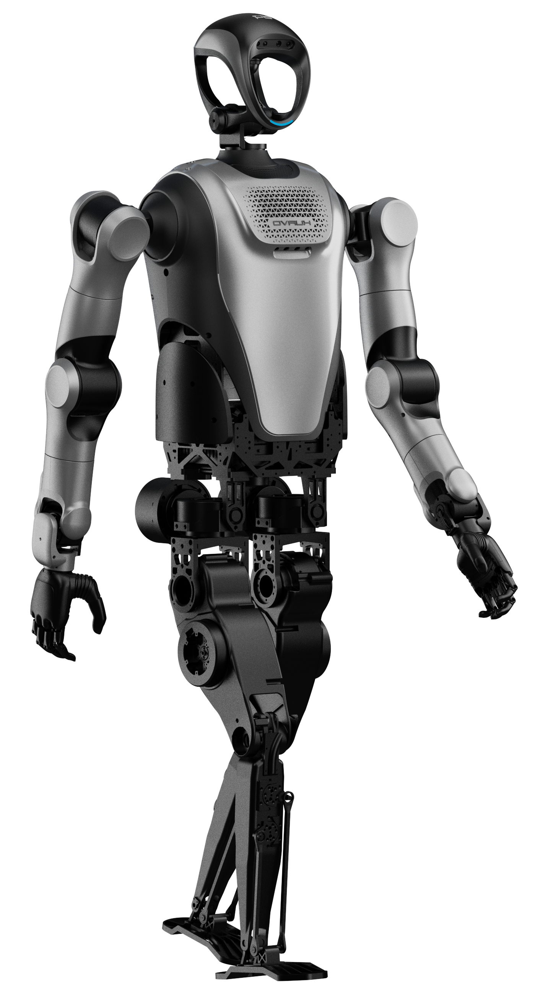

# Le-Tong(LeT): A Real World Humanoid Robot Dataset for Multi-Task Robot Learning

---

<div align="center">

 [中文](README.md) | **English** 

</div>

---

## 📋 Table of Contents
- [🌟 Overview](#overview)
- [✨ Key Features](#-key-features)
- [🤖 Hardware Platform](#-hardware-platform)
- [🎬 Tasks](#-tasks)
- [📦 Dataset](#-dataset)
- [🚀 Usage](#-usage)
- [📊 Stats](#-stats)
- [📝 Citation](#-citation)
- [📄 License](#-license)
- [🙏 Acknowledgement](#-acknowledgement)

---

## 🌟 Overview
We introduce <strong>Le-Tong(LeT)</strong>, a <strong>real world dataset</strong> with <strong>multi-task, multi-scene </strong>demonstrations captured on a full-scale humanoid robot, <strong>Kuavo 4 pro</strong>. It provides rich sensory signals and action trajectories for <strong>manipulation, mobility, and interactive tasks</strong>, enabling scalable robot learning in real environments.

***(images@品宣)***

---

## ✨ Key Features
- 🕐  Extensive real world, full scale humanoid robot demonstrations<strong>(continually updating)</strong>

- 🌍 Diverse domains including <strong>industrial, home, medical, service etc.</strong>

- 🎯 Rich multi-task coverage: <strong>grasping, bimanual actions, tool use, locomotion, navigation, handover, fine manipulation</strong>

- ✅ <strong>Expert-labeled and human-verified demonstrations</strong>

- 🔧 Robust processing pipeline: <strong>unified utilities and training-ready data loaders</strong>

---

## 🤖 Hardware Platform
<div style="display: flex; justify-content: space-between; align-items: center;">
  
  
</div>

Above are the main hardware platforms used in our dataset, <strong>Kuavo 4 pro</strong> and <strong>Kuavo 4 pro Wheel Edition</strong>.

- 📏 <strong>Robot Parameters</strong>: Height 1.66 m, Weight 55 kg, Support battery replacement without shutting down
- 🎮 <strong>Flexible Motion Control</strong>: 40 Degree of Freedom, Maximum walking speed of 7km/h and bipedal autonomous SLAM
- 🧠 <strong>High Generalization</strong>: Supporting access to multi-modal large models such as Pangu, DeepSeek, ChatGPT, etc., with a total of 20+ Atomic skills

---

## 🎬 Tasks
***(TBD)(GIF)@训练场***

---

## 📦 Dataset

### 📁 Dataset Directory Structure
***(a tree here@行帅)***

### 📄 Data Format

All data are in the original **rosbag** format, with detailed information as follows:

> 📌 **Note**: Click on each topic below to expand and view its detailed specifications.

<details open>
<summary><strong>Rosbag Topic Demonstration</strong></summary>

<details>
<summary>Camera RGB Image Data</summary>

- <strong>/cam_x/color/image_raw/compressed</strong>
    1. Description

        This ROS topic is used to provide the post-compression original RGB imaging data from the camera sensors. x here being h, l or r, denoting head, left and right wrist cameras

    2. Message type

        Type: sensor_msgs/CompressedImage

    3. Message body
        - header (std_msgs/Header): Message head; includes timestamp, serial number, coordinate system identification, etc.
        - format (string): Image encoding format
        - data (uint8[]): Image data

</details>

<details>
<summary>Camera Depth Image Data</summary>

- <strong>/cam_x/depth/image_rect_raw/compressed</strong>
    1. Description

        This ROS topic is used to provide the post-compression original depth imaging data from the camera sensors. x here being h, l or r, denoting head, left and right wrist cameras

    2. Message type

        Type: sensor_msgs/CompressedImage

    3. Message body
        - header (std_msgs/Header): Message head; includes timestamp, serial number, coordinate system identification, etc.
        - format (string): Image encoding format
        - data (uint8[]): Image data

</details>

<details>
<summary>Arm trajectory control</summary>

- <strong>/kuavo_arm_traj</strong>
    1. Description

        This ROS topic is used to control the arm trajectories of the robot. It publishes arm target joint positions to control the arms with high precision.

    2. Message type

        Type: sensor_msgs/JointState

    3. Message body
        - header (std_msgs/Header): Message head; includes timestamp, serial number, coordinate system identification, etc.

        - name (list of string): List of the arm joints. When there are 14 joints in total, the names will be from “arm_joint_1” to “arm_joint_14”.

        - position (list of float): A list of current arm joint positions. The data structure is similar to items 12-25 of sensor_data_raw below.

</details>

<details>
<summary>Raw sensor data</summary>

- <strong>/sensors_data_raw</strong>
    1. Description

        Topic used to publish all real-robot or simulator raw sensor data, from joint data to IMU data to end effector data

    2. Message type
        
        Type: kuavo_msgs/sensorsData

    3. Message body
        
        - sensor_time (time): Timestamp

        - joint_data (kuavo_msgs/jointData): Joint data: position, velocity, acceleration, current

        - imu_data (kuavo_msgs/imuData): Includes gyroscope, accelerometer, free angular velocity, quarternion

        - end_effector_data (kuavo_msgs/endEffectorData): End effector data, not currently used.

    4. Joint data description
        - Order of data

            - First 12 elements are lower body motor data:

                - 0~5 are left limb data (l_leg_roll, l_leg_yaw, l_leg_pitch, l_knee, l_foot_pitch, l_foot_roll)

                - 6~11 are right limb data (r_leg_roll, r_leg_yaw, r_leg_pitch, r_knee, r_foot_pitch, r_foot_roll)

            - The subsequent 14 elements are arm motor data:

                - 12~18 are left arm motor data (“l_arm_pitch”, “l_arm_roll”, “l_arm_yaw”, “l_forearm_pitch”, “l_hand_yaw”, “l_hand_pitch”, “l_hand_roll”)

                - 19~25 are right arm motor data (“r_arm_pitch”, “r_arm_roll”, “r_arm_yaw”, “r_forearm_pitch”, “r_hand_yaw”, “r_hand_pitch”, “r_hand_roll”)

            - The last 2 elements are head motor data: head_yaw and head_pitch

        - Units:

            - Positions: radians

            - Speed: radians per second (radian/s)

            - Acceleration: radians per square second (radian/s²)

            - Current: Amperes (A)

    5. IMU Data Description
        - gyro: Gyroscope angular velocities, in rad/s

        - acc: Accelerometer acceleration, in m/s²

        - quat: IMU orientation

</details>

<details>
<summary>Dexterous hand position (Real Robot dataset only)</summary>

- <strong>/control_robot_hand_position</strong>
    1. Description

        This ROS topic is used to control the movement of both hands. It publishes target joint positions to control the hands with high precision.

    2. Message type
        
        Type: kuavo_msgs/robotHandPosition

    3. Message body
    
        - left_hand_position (list of float): Left hand position in a size 6 array, each element is between [0, 100], where 0 is fully open, 100 is fully closed

        - right_hand_position (list of float) Right hand position in a size 6 array, each element is between [0, 100], where 0 is fully open, 100 is fully closed

</details>

<details>
<summary>Dexterous hand state (Real Robot dataset only)</summary>

- <strong>/dexhand/state</strong>
    1. Description

        This ROS topic is used to publish dexterous hands’ status

    2. Message type

        Type: sensor_msgs/JointState

    3. Message body
        - name (list of string): list of joint names, 12 joints in total:

        - position (list of float): List of joint positions, 12 in total, first 6 being left joint positions, later 6 being right joint positions

        - velocity (list of float): List of joint velocities, 12 in total, first 6 being left joint velocities, later 6 being right joint velocities

        - effort (list of float): List of joint (electrical) current, 12 in total, first 6 being left joint current data, later 6 being right joint current data

</details>

<details>
<summary>Claw control data (Real Robot dataset only)</summary>

- <strong>/control_robot_leju_claw</strong>
    1. Description

        This ROS topic is used to control the robot hands (i.e. two-finger claws)

    2. Message type
    
        Type: kuavo_msgs/controlLejuClaw

    3. Message body
        - name (list of string): Length 2 list, consisting of “left_claw”, “right_claw”

        - position (list of float): Length 2 list, consisting of left and right claw target positions, each element is between [0, 100], where 0 denotes fully open, 100 denotes fully closed

        - velocity (list of float): Length 2 list, target velocities for the claws, again between [0, 100]. Defaults to 50.

        - effort (list of float): Length 2 list, target current for claws, in Amps. Defaults to 1 Amp

</details>

<details>
<summary>Claw states (Real Robot dataset only)</summary>

- <strong>/leju_claw_state</strong>
    1. Description
        
        /leju_claw_state topic is used to publish the state, position, velocity and efforts of each of the claws.

    2. Type
        
        kuavo_msgs/lejuClawState

    3. Message body
        - state: Data type int8[]; Length 2 list denoting Claw states. First element denotes left claw, the other being right claw.

        - data: Data type kuavo_msgs/endEffectorData; Claw position, velocity and effort

        - state values’ meanings:

            - -1: Error, indicating execution error

            - 0: Unknown, default status upon initialisation

            - 1: Moving, indicating movement of the claws in progress

            - 2: Reached, indicating the target positions have been successfully reached

            - 3: Grabbed, indicating successful grasp of an item

            Please refer to the descriptions in /control_robot_leju_claw for all the kuavo_msgs/endEffectorData messages inside data.

</details>


<details>
<summary>Gripper control (Simulator dataset only)</summary>

- <strong>/gripper/command</strong>
    1. Description

        This ROS topic is used to control the grippers (fingers)’ movement in the simulator.

    2. Message type

        Type: sensor_msgs/JointState

    3. Message body
        - header (std_msgs/Header): Message head; includes timestamp, serial number, coordinate system identification, etc.

        - position (list of float): Size 2 array, data being the target positions of the left and right grippers, each element is between [0, 255], where 0 is fully open and 255 is fully shut.

</details>

<details>
<summary>Gripper state (Simulator dataset only)</summary>

- <strong>/gripper/state</strong>
    1. Description
        
        This ROS topic is used to capture the current movement of the grippers (fingers) in the simulator.

    2. Message type
        
        Type: sensor_msgs/JointState

    3. Message body
        - header (std_msgs/Header): Message head; includes timestamp, serial number, coordinate system identification, etc.

        - position (list of float): Size 2 array, data being the current positions of the left and right grippers, each element is between [0, 0.8], where 0 is fully open and 0.8 is fully shut

</details>

<details>
<summary>Robot positional commands (Simulation Task 4 only)</summary>

- <strong>/cmd_pose_world</strong>
    1. Description
        
        Topic used to publish robot position commands

    2. Message type
        
        Type: geometry_msgs/Twist

    3. Message body
        - linear.x (float): x-directional data in world coordinates, in metres

        - linear.y (float): y-directional data in world coordinates, in metres

        - linear.z (float): z-directional data in world coordinates, in metres

        - angular.x (float): x-directional rotation angle in world coordinates, in radians

        - angular.y (float): y-directional rotation angle in world coordinates, in radians

        - angular.z (float): z-directional rotation angle in world coordinates, in radians

</details>

</details>

### 🏷️ Label Format
Annotation information is stored in a JSON file with the same name as the bag file. 

Example:
```json
{
  "loaction": "长三角一体化示范区智能机器人训练中心", // Data source
  "primaryScene": "默认一级场景", // Primary scene name
  "primarySceneCode": "default_level_one_scene", // Primary scene code
  "secondaryScene": "3C工厂场景", // Secondary scene name
  "secondarySceneCode": "3C factory manufacturing", // Secondary scene code
  "tertiaryScene": "线圈分拣", // Tertiary scene name
  "tertiarySceneCode": "Coil sorting", // Tertiary scene code
  "initSceneText": "各种颜色的线圈放置在桌子中间，物料箱放置在桌子两边，机器人位于桌子后方", // Initial scene description
  "englishInitSceneText": "Coils of various colors are placed in the middle of the table, material boxes are placed on both sides of the table, and the robot is located at the back of the table", // Initial scene description (English)
  "taskGroupName": "单个线圈分拣", // Task group name
  "taskGroupCode": "single_coil_sorting", // Task group code
  "taskName": "7-22-线圈分类", // Task name
  "taskCode": "XQFL_11", // Task code
  "deviceSn": "P4-209", // Device serial number
  "taskPrompt": "", // Task description
  "marks": [ // Annotation segments
    {
      "taskId": "1947326026455584768", // Task ID
      "markStart": "2025-07-22 9:18:39.640", // Mark start timestamp
      "markEnd": "2025-07-22 9:18:39.814", // Mark end timestamp
      "duration": 0.233, // Mark duration (seconds)
      "startPosition": 0.7363737795977026, // Mark start position
      "endPosition": 0.769568869806783, // Mark end position
      "skillAtomic": "pick", // Atomic skill
      "skillDetail": "从桌子上拿起线圈", // Skill detail
      "enSkillDetail": "pick coil from table", // Skill detail (English)
      "markType": "step" // Mark type
    },
    {
      "taskId": "1947326026455584768", // Task ID
      "markStart": "2025-07-22 9:18:40.950", // Mark start timestamp
      "markEnd": "2025-07-22 9:18:41.180", // Mark end timestamp
      "duration": 0.23, // Mark duration (seconds)
      "startPosition": 0.9228460404165317, // Mark start position
      "endPosition": 0.9556361498412722, // Mark end position
      "skillAtomic": "place", // Atomic skill
      "skillDetail": "将线圈放置到物料箱中", // Skill detail
      "enSkillDetail": "place coil in material box", // Skill detail (English)
      "markType": "step" // Mark type
    }
  ]
}
```

---

## 🚀 Usage


We provide a comprehensive example repository to demonstrate how to use our dataset, including:

- 🔄 <strong>A data conversion tool (`rosbag2lerobot`)</strong> to convert raw rosbag files into formats suitable for model training.
- 🤖 Implementations and examples for <strong>two imitation learning models</strong>: Diffusion Policy and ACT.
- 🎓 <strong>Model training scripts</strong> for training on our dataset.
- 🚁 Full code and instructions for <strong>deployment</strong>, both in real-world robot and simulation environments.

Please refer to our open-source repository: <strong>[kuavo_data_challenge](https://github.com/LejuRobotics/kuavo_data_challenge)</strong>.

The repository contains documentation, setup instructions, and running examples. We recommend users start from there for dataset preparation, training, and deployment workflows.

---

## 📊 Stats
(TBD)

---

## 📝 Citation
If you use this dataset in your research, please cite:
```
(TBD)
```

---

## 📄 License
(TBD)

---

## 🙏 Acknowledgement
(TBD)